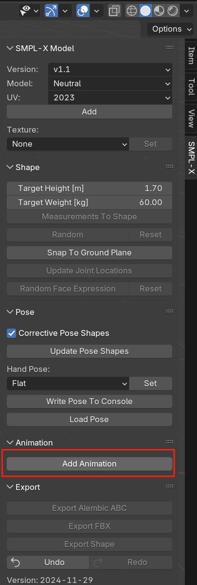
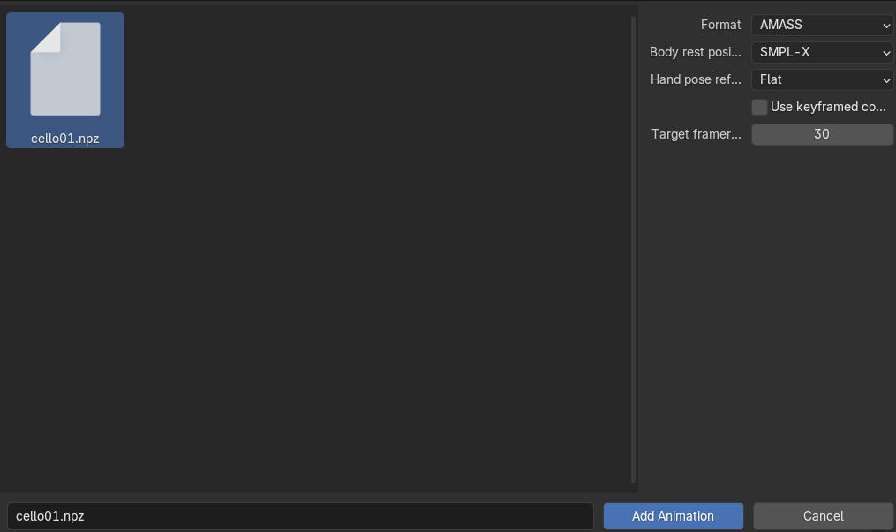
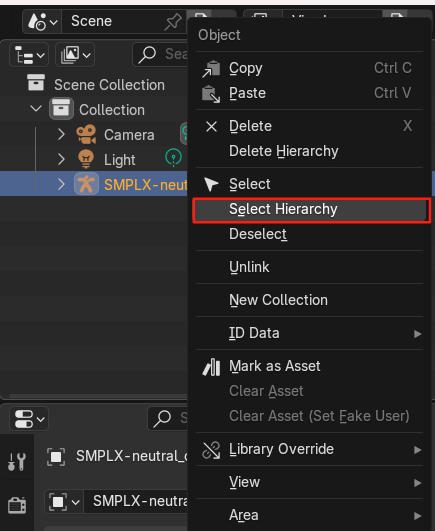
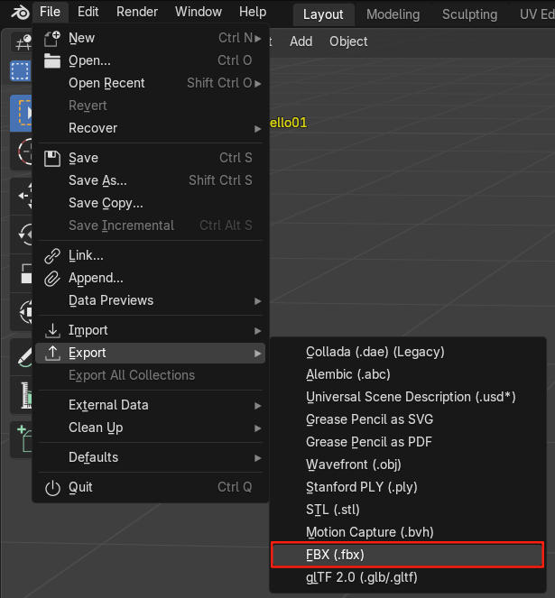
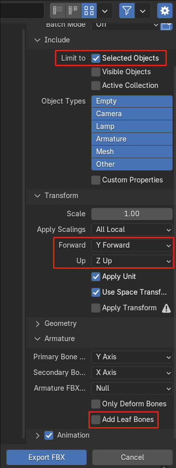

# Blender Add-on Export FBX for UE

## Step 1: Add Animation

Our model is based on the Neutral SMPL-X Model.

Add Animation by the Add-on.

## Step 2: Choose the npz

Choose the generated npz by get_blender_animation_from_train/gen.py

## Step 3: Select Hierarchy

Select Hierarchy to export the complete SMPL-X Model in FBX format

## Step 4: Export FBX

Export by Blender, not the Add-on

## Step 5: FBX options

Include: Limit to Selected Object.

Transform: Y Forward, Z Up

Armature: **DO NOT** Add Leaf Bones

